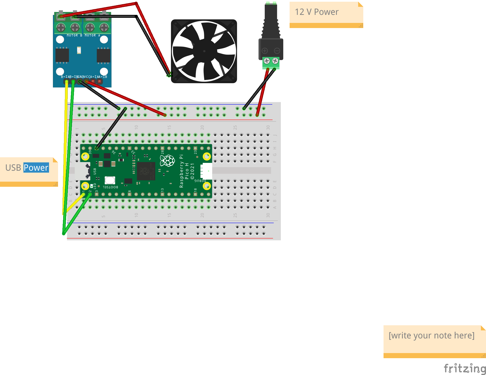

# L9110 
There appear to be few guides on the internet that walk someone through setting up a Raspberry Pi Pico and using an L9110 module with a 12V DC fan/motor and pwm.

There are some that come close, but add additional components and some that have mostly text, however here is a simple example of how to use just those components in a very simple fashion.
There are caveats/warning about using 12V with 3.3/5V microcontrollers in some forums, but you can follow this setup safely - make sure the current does not exceed the rating of the L9110. For *smaller* hobby motors, this is typically not a problem.

Lots of documentation/urls exist inside the pwm_runner file as well.

**Fritzing Schematic**

| Pico              | L9110| 
| --------          | --------- |
| GPIO 0            | Motor B1A |
| GPIO 1            | Motor B1B |

| Pico              | Breadboard|
| --------          | --------- |
| GND               | GND/rail  |

| Breadboard         | L9110|
| --------           | --------- |
| GND/rail           | GND      |
| +/5V/rail          | VCC      |

| Breadboard         | 5V Power|
| --------           | --------- |
| GND on Breadboard | -/5V |
| PWR on Breadboard | +/5V |

